# SUBSTRAT — Analog Layout Workflow Management System

## 1. Project Title & Team

- **Project Name:** SUBSTRAT
- **Team Name:** SKYHIGH
- **Team Lead:** Charan Annamalai A
- **Team Members:** Charan Annamalai A, Magesh K, Chandrasekar L
- **Institution:** Chennai Institute Of Technology

---

## 2. Problem Statement

Analog layout is a complex and time-consuming phase in the semiconductor lifecycle. Teams typically rely on manual spreadsheets to track progress, which leads to several issues:
- **Verification Bottlenecks:** Hard to track real-time progress during DRC and LVS checks.
- **Workflow Tracking Difficulty:** Manual status updates cause delays in moving to the next stage.
- **Dependency Management:** It is difficult to visualize which blocks are holding up others.
- **Coordination Delays:** Too much time is spent in sync-up meetings instead of active layout work.

SUBSTRAT is a web-based dashboard designed to solve these challenges by providing a centralized platform to track layout blocks, manage dependencies, and monitor overall project progress in real time.

---

## 3. Application Flow

1. **Authentication:** Secure login using Google OAuth 2.0 with separate roles for Managers and Engineers.
2. **Dashboard Overview:** Managers view project health, track bottlenecks, and manage overall progress.
3. **Block Management:** Managers create layout blocks and assign them to specific engineers.
4. **Dependency Tracking:** Blocks can be linked to show dependencies, preventing downstream work until upstream tasks are finished.
5. **Engineer Workspace:** Engineers view their assigned blocks and update their status through standard verification stages (DRC, LVS).
6. **Review Process:** Completed layouts are submitted for manager review, where they can be approved or rejected with feedback.
7. **Bottleneck Detection:** The system highlights blocks that are delayed or blocking other tasks.
8. **Audit Trail:** All status changes and updates are logged for team accountability.

---

## 4. Tech Stack Used

| Category | Technology |
| :--- | :--- |
| **Frontend** | React v18, Vite, React Router, CSS Modules |
| **Backend** | Node.js v20, Express.js |
| **Database** | MongoDB, Mongoose |
| **Authentication**| Google OAuth 2.0, Passport.js, JWT |
| **UI Icons** | Lucide React |

---

## 5. UI Screenshots

### Authentication

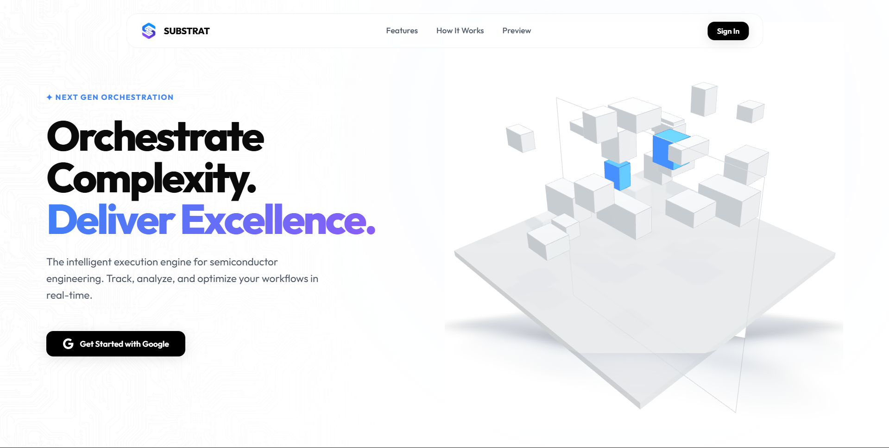

Secure Google OAuth based authentication gateway with role-based access.

---

### Manager Workspace

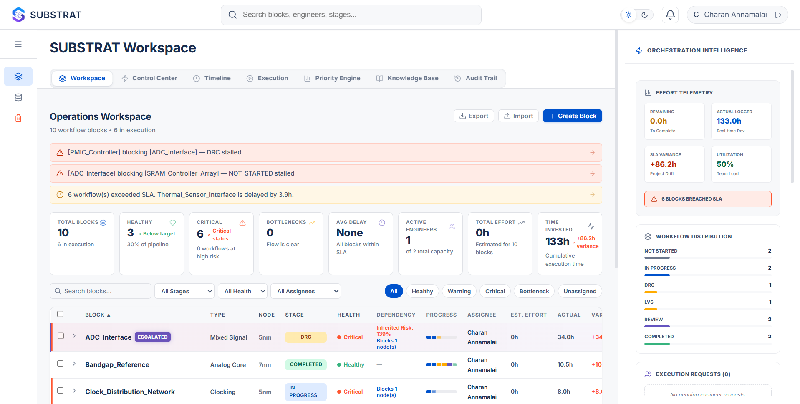

Central orchestration dashboard for workflow tracking, SLA monitoring, and execution visibility.

---

### Control Center

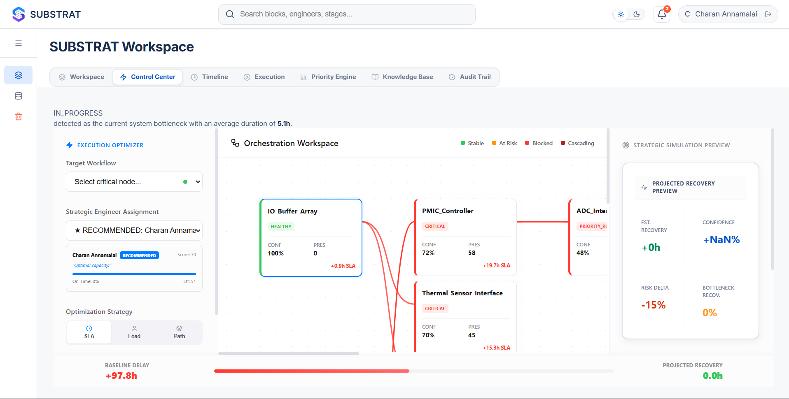

Operational analytics hub for execution telemetry and bottleneck monitoring.

---

### Timeline View

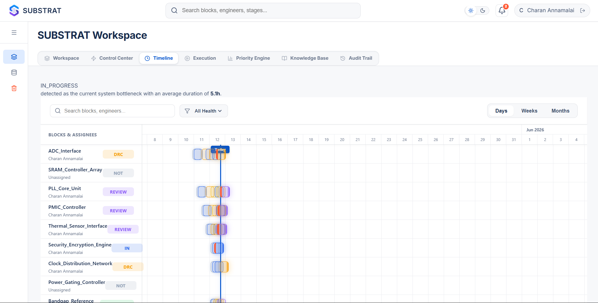

Visual workflow timeline showing stage progression and execution history.

---

### Execution Console

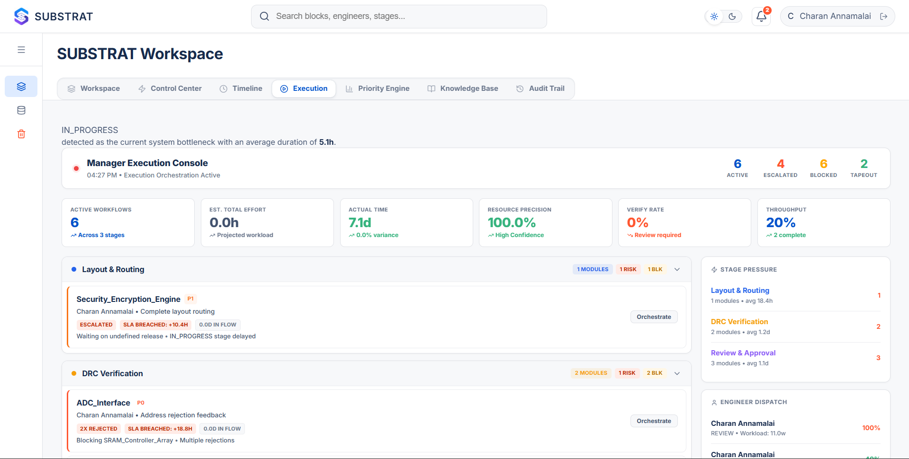

Manager-side execution monitoring with live workflow telemetry and activity tracking.

---

### Priority Engine

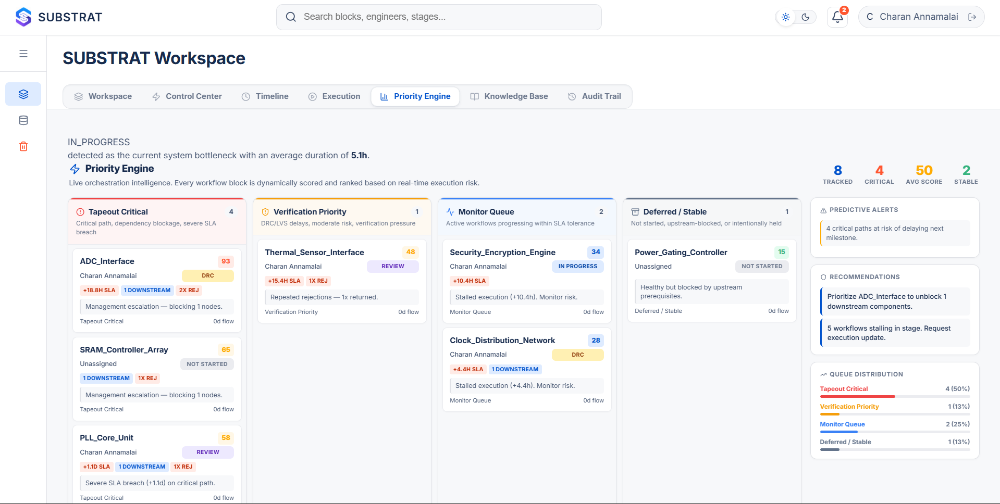

Risk-aware prioritization engine surfacing critical workflows and dependency pressure.

---

### Knowledge Base

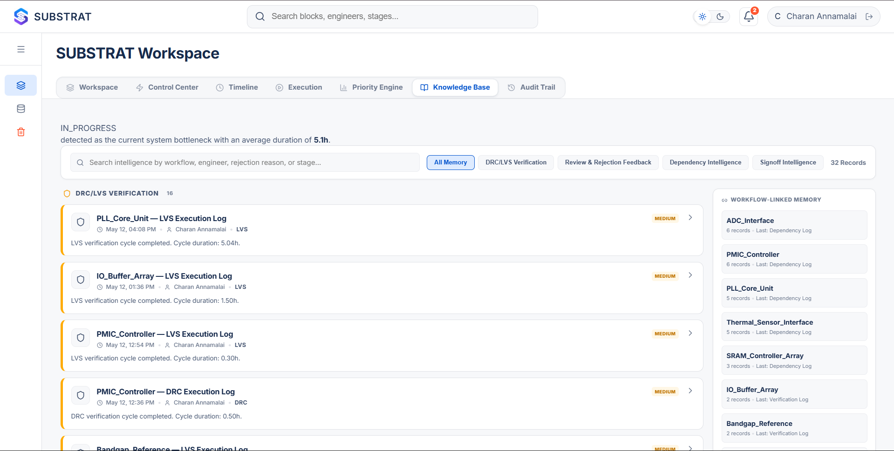

Centralized repository for workflow-linked technical documentation and verification notes.

---

### Audit Trail

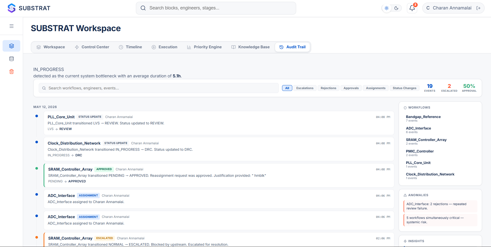

Complete execution history and action logging for workflow traceability.

---

### Engineer Workspace

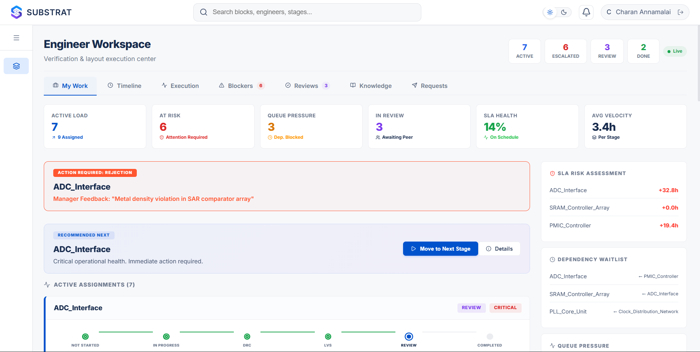

Focused engineer dashboard for assigned workflow execution and progress tracking.

---

### Engineer Timeline

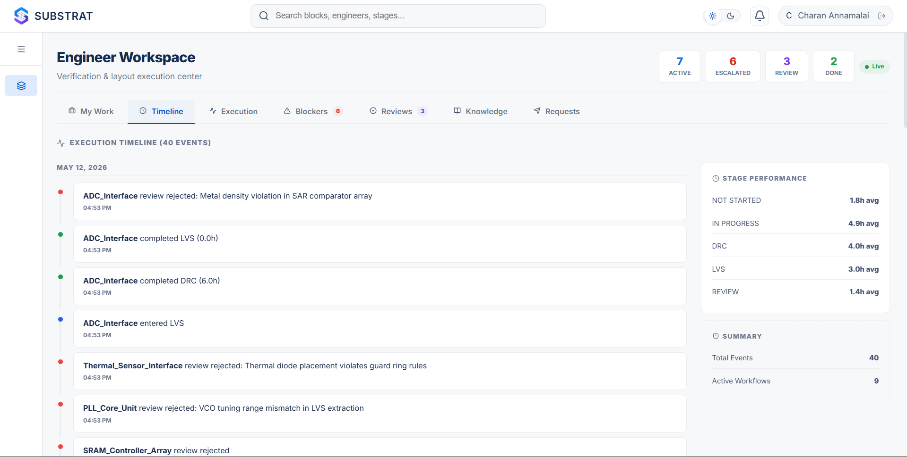

Engineer-side timeline view for tracking verification stage movement.

---

### Engineer Execution

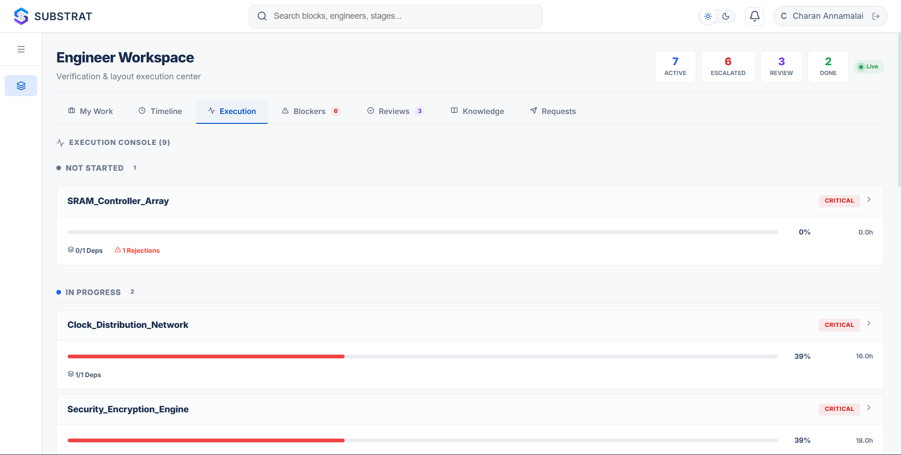

Execution workspace for progressing blocks through DRC, LVS, REVIEW, and completion.

---

### Blockers Resolution System

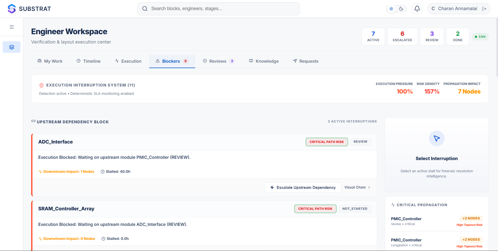

Real-time blocker identification with dependency impact visibility.

---

### Review Center

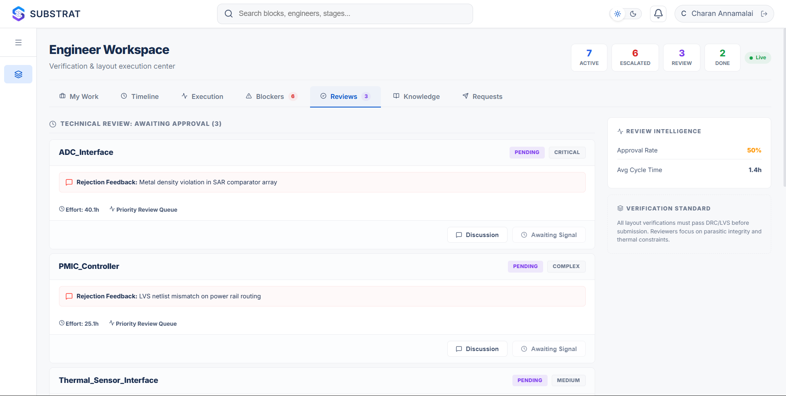

Technical review and approval workflow with verification tracking.

---

### Engineer Knowledge Workspace

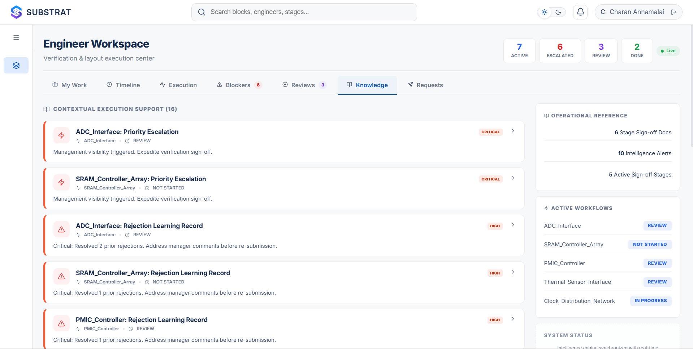

Engineer-facing contextual knowledge and workflow reference system.

---

### Requests Workspace

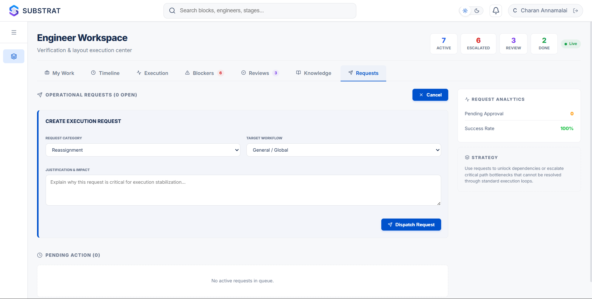

Task request and escalation management interface for engineers.

---

### Block Creation System

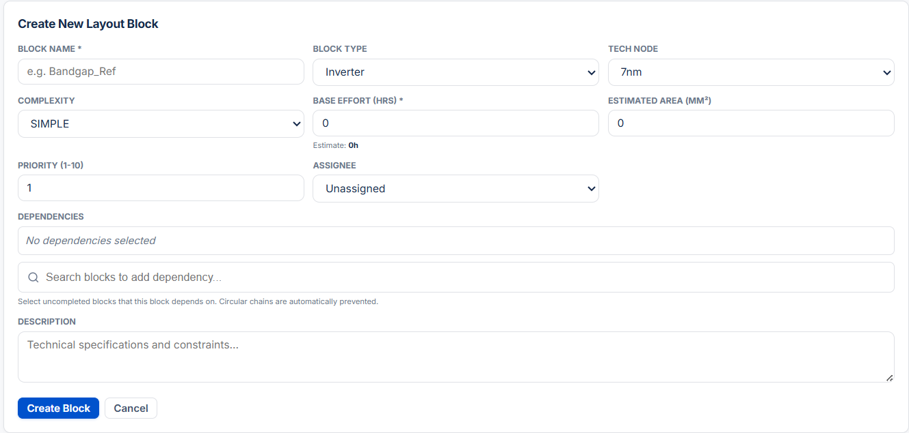

Workflow block configuration interface with dependency orchestration and estimation controls.

---

## 6. Setup Instructions

### Prerequisites
- Node.js v20+
- MongoDB instance (local or Atlas)

### Clone Repository
```bash
git clone https://github.com/Charan-2006/SKYHIGH_EPIC.git
cd SKYHIGH_EPIC
```

### Backend Setup
```bash
cd backend
npm install
cp .env.example .env
# Fill in your database and Google OAuth credentials in .env
npm start
```

### Frontend Setup
```bash
cd ../frontend
npm install
npm run dev
```

---

## 7. Environment Variables

Create a `.env` file in the `backend` directory based on `.env.example`. 

```env
PORT=5000
MONGODB_URI=your_mongodb_connection_string
JWT_SECRET=your_jwt_secret
GOOGLE_CLIENT_ID=your_google_oauth_client_id
GOOGLE_CLIENT_SECRET=your_google_oauth_client_secret
GOOGLE_CALLBACK_URL=http://localhost:5000/api/auth/google/callback
FRONTEND_URL=http://localhost:5173
```

---

## 8. Features Implemented

- **Role-Based Workspaces:** Separate dashboards for Managers and Engineers.
- **State Machine Tracking:** Layouts progress through standard stages (NOT_STARTED, IN_PROGRESS, DRC, LVS, REVIEW, COMPLETED).
- **Dependency Management:** Upstream block completion status is visually tracked to prevent out-of-order execution.
- **Manager Review Loop:** Dedicated UI for managers to approve or reject finished layouts.
- **Event Logging:** All major actions (stage changes, assignments, approvals) are recorded in an audit trail.
- **Basic Analytics:** Simple metrics showing delayed blocks and bottleneck stages.

---

## 9. Known Issues / Limitations

- **No WebSocket Sync:** Updates currently rely on standard HTTP requests and polling; real-time sync is not implemented.
- **Simulated Notifications:** In-app notifications are generated locally; there is no email or Slack integration yet.
- **Dependency Engine:** The current dependency tracking is simple and could be improved for more complex, non-linear relationships.
- **Scalability:** The UI is not yet optimized for projects with a very large number of concurrent blocks (e.g., 500+).

---

## 10. Submission Rules Compliance

- [x] Private Repository
- [x] README.md completed
- [x] .env.example included
- [x] package.json configured
- [x] All source files included
- [x] Google OAuth integrated
- [x] MongoDB integration completed
- [x] npm install supported
- [x] Demo data generation implemented
